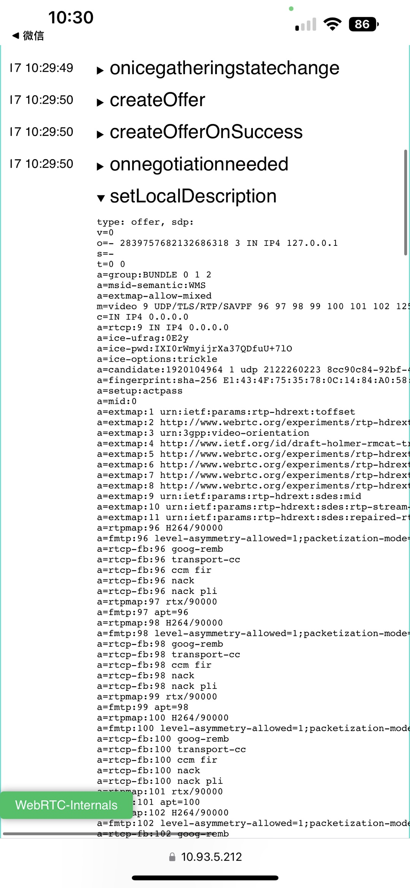
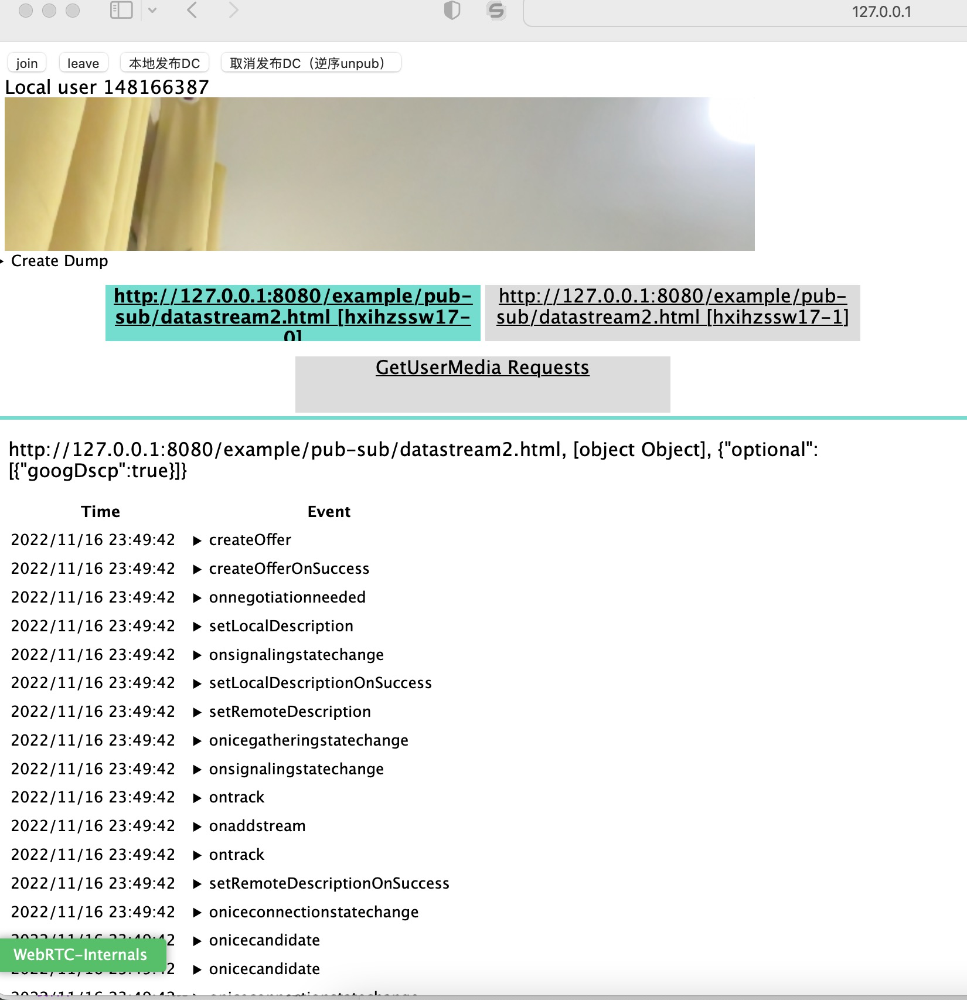

# WebRTC-Internals-Safari

使用方式：

1、Mac safari 插件：先下载 Stay2，将打包的 js，拷贝到脚本即可；

2、适用于 safari/firefox/移动端，demo 集成方式，可以将其放置在 body 下, ，加在 body 下就可以了

示例图片：

# build

yarn
yarn build

# dev

yarn
yarn dev
http-sever

# config

配置参数存储在 window 下 RTC_INTERNALS\_\_PARAMS，可以直接需改/引用

# config

因为会涉及更改 PC 原型方法，必须在 pc 建立前加载，否则会失效！！！

# 已知局限性

工具已引入了 webrtc-adapter，但还是有部分其他浏览器与 chrome 差异造成的问题，如下：
1.safari/firefox 在 ICE Candidate pair/grid 上数据存在局限性，（可通过观察 sdp 判断 candidate）
