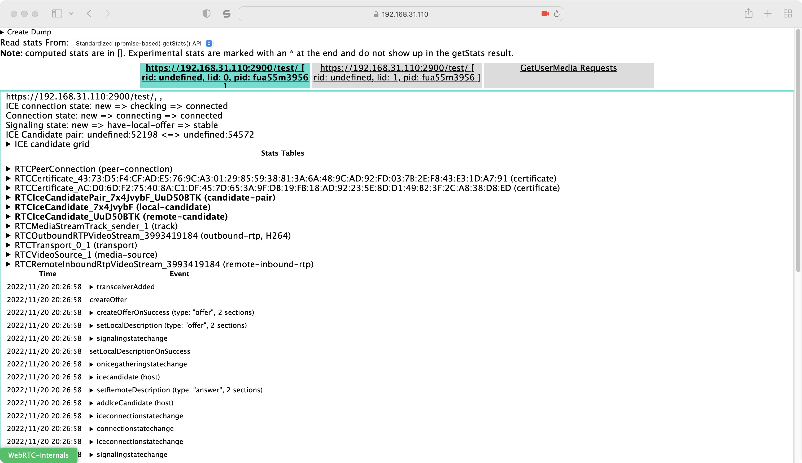
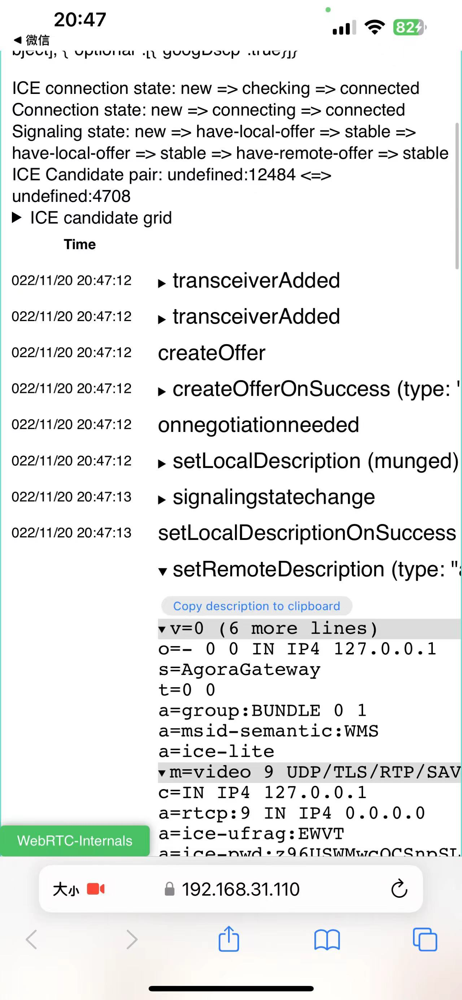
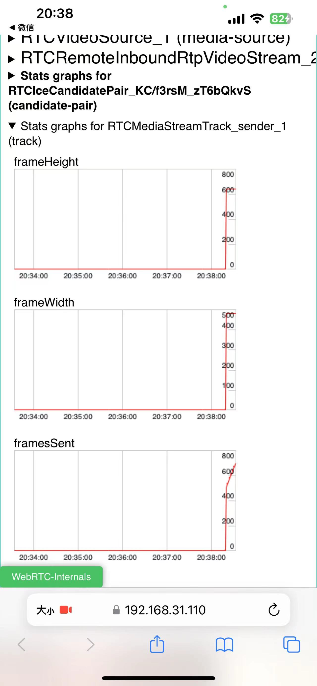

# WebRTC-Internals

[English](./README.md) | 简体中文

demo: https://ltsg123.github.io/webrtc-internals/

示例图片：




## config

配置参数存储在 window 下 RTC_INTERNALS_PARAMS，可以直接需改/引用

## ⚠️

因为会涉及更改 PC 原型方法，必须在 pc 建立前加载，否则会失效！！！

## 已知局限性

工具已引入了 webrtc-adapter，但还是有部分其他浏览器与 chrome 差异造成的问题，如下：

1.safari/firefox 在 ICE Candidate pair/grid 上数据存在局限性，（可通过观察 sdp 判断 candidate）

## Install

Use `npm`

```
# with npm
npm i webrtc-internals-adapter
```

CDN is also provided

```
<script src="https://ltsg123.github.io/webrtc-internals/dist/index.js"></script>
```

Any questions you can contact me at ltsg0317@outlook.com
